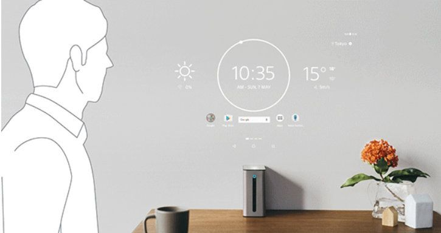
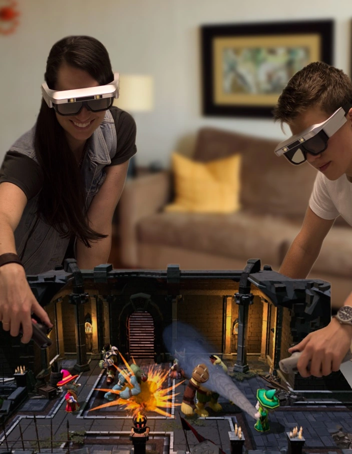
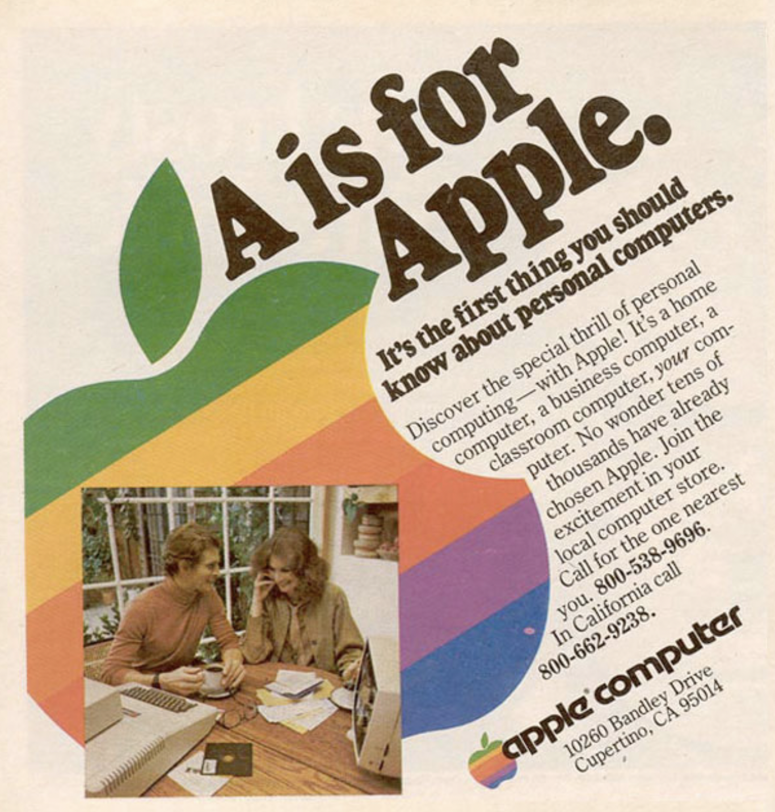
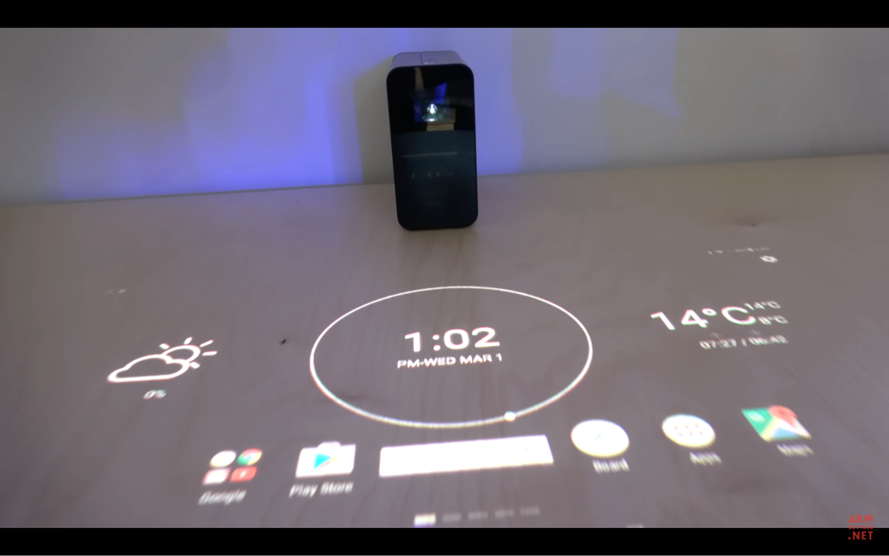
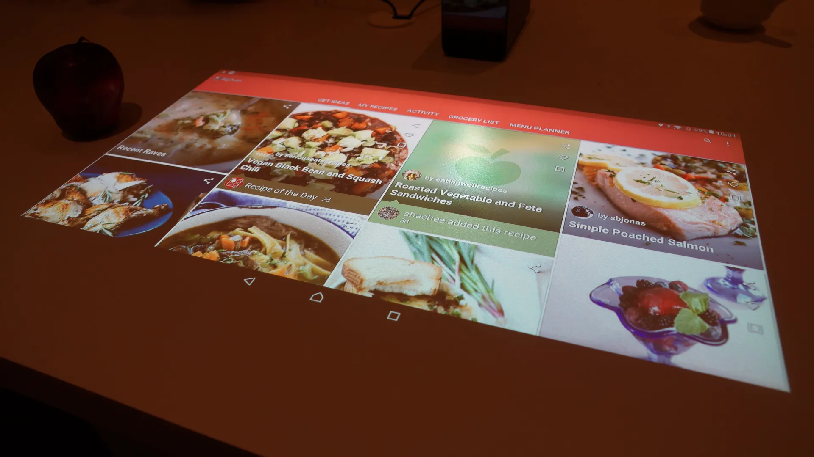

# Projector-Camera Systems: There Be Dragons Here

Camera and projectors yearn to be merged. Both involve pixels, similar frame
rates, fields of view, and resolutions.  The instinct for this merger goes back
decades, and its devotes rally under the monicker “PROCAM”.

Venture Capitalists who fund startups and Vice Presidents at established tech
companies are frequently pitched consumer PROCAMs. One pitch might go “We can
make everyday surfaces like tabletopcs smart/alive!”. A more business-oriented
one might try “We can present our platform to our users in new magical ways!”
Other attempts: “We'll delight users by bringing them closer to their data”,
“We'll seamlessly meld the digital and physical”, "It's augmented reality
without a clunky face-computer", "It's the the fourth screen in your life!".
I’m making up these quotes, but all of them strike close to home for me. PROCAM
projects sometimes ship, but have never become the successes their inventors
hope for. Each time, new lessons are learned then forgotten. Years later, new
PROCAM pitches resurface as new employees gain prominence and old VCs and VPs
cycle.

This article is about consumer PROCAMs and why they haven’t taken off.  I
believe the instinct behind PROCAMs is sound.  I’ve been involved in PROCAM
projects four times in my career, in both small and large companies, sometimes
as a founder, sometimes as an engineer, and sometimes as a spectator, holding
back the urge to jump back into the ring.

Most commercial ventures fail because there are many more ways to fail than
there are ways to succeed.  I suspect the failure rate of PROCAM project
is not much worse than that of any other high-tech endeavor. But PROCAM
projects seem to have similar failure patterns. My hope is that by documenting
these failures, someone can find a way through the pitfalls and build a PROCAM
that takes the world by storm.

## What Projector Camera Systems Look like

There is joy in watching a wall, a tabletop, or even a shoe, respond to touch.
The instinct to animate everyday objects seems fundamental.  This might be why
PROCAM projects are pitched so regularly in so many different forms.

Microsoft
[Lightspace](https://www.microsoft.com/en-us/research/video/lightspace/)
project probably went farther than any other to showcase what PROCAMs could do:

Lightspace engendered a number of other successful projects at Microsoft, but
Lightscape itself wound down over time.

Other companies expanded the projection surface beyond Lightspace's walls, hands, and
tabletops, onto buildings and landscapes  (examples below are from from Obscura
Digital and Lightform):

{:width="240px"}
{:width="240px"}

These companies showcased what PROCAMs can do in the hands of professionals and
researchers.  But this article is about consumer PROCAMs.

Here is one PROCAM that projected on windows:

This was Navdy, an after-market head-up display (HUD) for cars. It had a
projector, a camera, and all the other components you’d expect from a PROCAM.

Here is Amazon’s Glow, a tabletop PROCAM that projects on tables:

You can play games, or make video calls with it. Here is Sony’s Experia Touch,
designed to project either on a wall or on a table depending on how it’s oriented:

[CastAR](https://venturebeat.com/2017/06/28/castars-collapse-shows-the-incredible-challenge-of-making-ar-games/)
were augmented reality glasses. Instead of shining light directly from the
glasses into your eyes, they projected light onto a special a retro-reflective
mat. The mat then bounced the light into 3D glasses. In some ways, this is a
much simpler optical design than most augmented reality glasses.

My own involvement in PROCAMs started academically in grad school.  PROCAMs
were in the air in the early 2000s. Later, I worked on Navdy, which had
aspirations of being the first Augmented Reality Head Up Display (I don't think
we ever publicly called it that).  I also worked in a big company on a device
with a similar audience and aspirations as the Amazon Glow and the Sony Xperia,
though not on those specifically. Our device never shipped. I also designed
displays for home assistant devices (like Alexa and Google Home), hoping to
turn them into a new generation of PROCAMs. That also didn’t take off.

## What goes wrong with Consumer PROCAMs

PROCAMs fall in similar pitfalls as any other technology projects:

1. Forgetting what Problem you're solving for your customer, and whether
they're willing to pay you for it. "Once they get a taste of our technology,
they'll be begging us for it". Especially with PROCAMs, this particular leap of
faith tends to end badly.

2. The competition from phones and tablets is stiff. If a tablet can get the
job done even partially adequately, a PROCAM will likley lose.  Instead of
picking a head-on fight with a entrenched incumbent, compete in a
market it cannot currently serve.

3. Mind the inherent limitations of the technology.  Projected images have
lower fidelity than an image displayed on an OLED or LCD panel. This is partly
due to limitations inherent to projection. No amount of research and
development can bridge this gap. The pitfall is to fall in love with your
technology and discount its limitations.

I'll belabor each of these in more detail below.

### Forgetting the customer: what problem will you solve for them, and are they willing to pay for it?

The pitfall is to focus on how the technology works and what makes it cool, and
delaying solving problems for a real customer. This is a subtle pitfall.
Everyone believes they're solving a problem for a real customer. The subtlety
of the trap is what we really mean by a "real customer", their "problem", and
what it means to "solve" it.

If your main pitch is that your PROCAM makes something “seamless”,
“delightful”, or offers “natural interactions”, there's a strong chance you're
either not solving a real problem, or your customer isn't real.  These quotes
superficially sound like benefits to their customers, but they’re actually
attributes of the technology. “You will finish your work faster”, “it’s
cheaper”, “other people will find you more appealing” are statements about
customer problems and their solutions.

Navdy tried to be many things: "A driving companion", "the embodiment of your
phone in your car", "an Augmented Reality HUD", and "a driving GPS".  Internal
teams found these useful.  The concept of a “driving companion” is helpful for
a UI designer trying to choose an aesthetic. “The embodiment of your phone in
your car” is helpful to decide how much of a phone’s capability to replicate in
Navdy. “Augmented Reality” was a way to embolden the optical engineering and
computer vision teams to think beyond standard HUD designs. “Driving GPS” is
what convinced the team that it was ok to use a very expensive GPS
chip inside Navdy. But none of these concepts represent a need from a customer. 

As useful as these concepts were for the Navdy team, “I want my phone 
embodied differently” isn’t a pain drivers feel. “I want my reality more
augmented” is also unrelatable. People seem, by and large, to be satisfied with
their phones as navigation devices. But within that satisfaction lurk minor
pain points: You sometimes miss a turn because you split your attention, and
often even put people's lives in danger.  Your eye has to change its focal
length as you glance between the road, you phone, then back. That adjustment
takes a few seconds, which mean the road is briefly out of focus. You also
waste time looking at your phone while your eye is out of focus. These moments
of defocus are dangerous. With a HUD, you don’t have to refocus your eyes
because the image plane is near the road.  Touchscreens are also dangerous.
They force you to look away from the road and take your hands off the wheel.
You interacted with Navdy with a wheel-mounted dial widget, you could keep your
hands on the wheel at all times.  These are  real but relatively minor
painpoints. Most drivers won't pay much just to be marginally safer drivers,
unless the product makes them _feel_ safe. And I don't think Navdy ever
optimized for the feeling of safety. In fact, I once asked our UX lead to
deprioritize a safety study he wanted to undertake because we were already a
year late shipping, and I wanted the team to focus on shipping. Navdy's mission
was never clearly about safety. Focus came late.  We were wrapped up in how
cool it was for too long. Had we started with customer safety pain points
sooner, we could have honed the marketing, and trimmed Navdy’s original list of
features much more quickly and more aggressively. This would have given us more
time to make Navdy’s focal length longer, its field of view larger, and its
body, and most importantly its price tag smaller. All of this would have been
in the service of helping drivers stay attentive to the road. These
improvements were relegated to Navdy 2, which was never to be.

Focusing on customer pain points is a skill. One learns it like any other
skill: by training and developing new instincts. Without training, one resorts
to old instincts, and most of these instincts probably came from ingesting
advertising. Ads that directly tackle a customer pain point are rare. Here’s an
early one from Apple:

The pain point amounts to “PCs are hard to learn. Apple makes it easier.” It’s
rare for consumer electronics ads today to explicitly call out the pain point
they tackle. Ads for established product categories, like computers, tend to
focus on specs (clock rate of the CPU, number of cores, amount of RAM, etc).
Specs are a short-hand for well-understood consumer pain points. For example,
"more RAM" is generally understood to solve the problem of computers stuttering
when too many programs are running.

Some ads can be even more removed from pain points. Here is an ad for a shoe, I
think:

It doesn’t mention any specs. It doesn’t even indirectly allude to a painpoint.
This ad itself is part of the product. When you wear a Nike product, you’ll
think back to this ad and feel more … whatever this ads wants you to feel.

Learning marketing by consuming advertising is an unreliable way to learn to
spot customer pain points. So is reading press coverage of a product. There are
excellent books that teach you to identify, think about, and relate to your
customer’s pain points. Anything by Steve Blank is a good starting point.  I
appear to be saying that consumers are mercenaries with well-defined pain
points and missions with clear economic agendas, and that the soul of a product
is irrelevant to them. To a first approximation, I’ll in fact claim exactly
this. I think it’s a helpful mental model for product development and a less
misleading one that the one engineers learn from exposing themsleves to the
barrel-end of advertising or the popular press.

The usual counter-argument against what I’m saying is that consumers do adopt
radically different technologies when they’re sufficiently magical, like Nest
thermostats, Apple watches, and the iPhone. These products replaced
well-established incumbents despite cost much more. Couldn’t a PROCAM do the
same? Yes, they could, but all those devices did two things: 1)  They solved an
important customer pain point that the incumbents weren't addressing, and they
charged a premium for it, 2) They marketed themselves as aspirational products.
That they pursued both approaches is what makes them confusing. It's tempting
to think that people buy them for the magic, but their value propositions is
straighforward.  The iPhone finally made it possible to browse web pages on the
go the way they appeared on desktops. The alternatives at the time were laptops
with GSM radio dongles, or Nokia phones with small screens and a web proxy that
reformatted web pages.  Nest thermostats updated the outmoded bakelite
aesthetic that Honeywell had popularized. Nest’s haptic dial and its beautiful
central display were technological enhancements that solved an interior design
pain points. Smart watches appear to solve primarily one pain point: receiving
notifications. This seems to be both the reason people purchase these devices
and how they actually use them long after their purchase [1, 2, 3]. Some
believe they also solve an aesthetic problems, or help with fitness, but the
studies I cited contradict each other on these points.

My point is that even soulful products tackle customer painpoints explicitly.
Their ads tend to be aspirational, so we don’t notice when they materially
improve our lives.

By the way, the Nike ad above has an impressive projected effect. The projector
appears to be projecting darkness instead of lightness. More on that later.

### The Competition from phones and tablets is stiff

The main competitor for a PROCAM is often a phone, a tablet, or a computer with
a large external monitor.  I believe that if these devices mostly solve a
customer's problem, PROCAMs will not gain ground on that customer problem.  For
similar optical performance, OLED and LCD panels are roughly 10x cheaper than a
projector. They don’t have problems with unintentional shadows being cast on
them. Their touch screens are also cheaper and more precise than the sensing
technology that detects and localizes touch in PROCAMs. Admittedly, these
economics aren’t inherent. They're reflections of the current economies of
scale of display panels, and this balance could shift in the future.

But maybe because PROCAMs are special-purpose, they remove friction compared to
these incumbents?  It’s tempting to claim advantages like “more natural”,
“frictionless”, “more delightful”, or “higher tech” to this list of attributes.
Here is the cost of being special-purpose: Users have to purchase, install,
learn, and maintain an additional piece of hardware. To use a phone, they have
to install an app. To overcome this friction, PROCAMs need more than just being
"more natural". They need to solve painpoints other devices can't address.

Navdy, Sony Xperia Touch, and Amazon Glow tackled domains that are already
partially serviced by phones and tablets. Navdy competed directly with Google
Maps running on a cell phone. Navdy had to provide enough value to compensate
for its hardware cost, the time it took install it in a car (about 30 minutes),
learning its user interface, and giving up on Google Map’s countless features.
I don't think we managed to make Navdy so useful that it compensated for its
setup cost and price. The Sony Xperia Touch ran Android, and I also personally
found it less convenient than a standard tablet that cost 5x less.

Before you build your PROCAM system, try to implement the solution to your
customer's problem on a tablet first. Does your tablet app seem to solve the
problem adequately? If so, congratulations!  Please market it and grow it as an
app. If your tablet app doesn’t take off, it might be a sign you’re tackling a
problem your customers don't value. But if you really believe your app isn't
taking off because it needs a projector, then I'll acquiesce. But there is an
enormous landscape of pain-points that are completely unaddressed by cell
phones. Why not start with one of those instead?

### Mind the inherent limitations of projectors

Projector magically turn a surface into a display. But it’s important to
understand the limitations of that display. First, projectors cast shadows when
a hand or a head is in front of it. This annoyance is often overlooked. Second,
projectors can't generate black pixels. When a projector pixel is off, you see
the color of the screen, which is usually white. In a dim enough environment,
this not a problem, but in typically lit environments, this results in poor
image contrast, especially compared to that of OLED displays. To compensate for
these effects, movie theaters are pitch black (1 lux, dimmer than the dimmest
reading of professional light meters). Both of these affects are inherent to
projection.  Future economies of scale and technical innovations are unlikely
to solve them. These effects dilute the magic of projection, particularly for
audiences who’re accustomed to the image quality of OLED panels.  The solution
is to adopt a more nuanced mental model of what projectors do.  "A projector is
millions of tiny spotlights" conveys its limitations more fairly than “it turn
any surfaces into a display”.

PROCAM teams recognize with these issues early on, but often don’t grapple with them until
it's too late. Here is the Amazon Glow marketing image again:

The screen on the table is white, but Elmo’s eyes are implausibly black. The pixels
of a projector can’t be darker than the background. Somebody photoshopped this
image! The team seemingly recognized that a compelling experience needed black
pixels. But because physics was unyielding so they resorted to Photoshop.

The flip side of the black pixel problem is that projectors have dismal
contrast under typical lighting. Here is the Sony Xperia at CES:

The walls of the booth are white, yet they appear gray. The walls of the booth
had to be extend to the ceiling of the convention center to block off the
ceiling lights and dim the booth enough to create adequate contrast for the
projector.  In the image below, the scene is so dim that you can barely see the
Experia Touch:

Shadows are a real problem with projectors. Here is a screen capture from a
demo video from Charbax playing with the Sony Experia Touch at CES:

Here is another image from Sony’s marketing team:

 

In this image, the shadow makes the text implausibly dimmer instead of
completely occluding it. The team seems to have recognized the problem with
shadows, but they couldn't solve it. They Photoshopped their way around it
in the short term.

It might seem unkind of me to have called out Photoshopped demos of PROCAMs. My
intention is not to embarrass, and I hope no one is embarrassed. I’m instead
illustrating how reluctant we are to accept the limitations of projectors. A
marketing Photoshoping a demo, or building a custom booth to cover for the
shortcomings of a product is strong feedback to the product team. If a
marketing team is having to do this for the product team, the product is
unlikely to succeed.  The solution is to pick problems where these limitations
aren’t problems. A PROCAM might just not be the right tool for the job if you
keep running into problems with contrast, shadows, and black pixels.

Back to this Nike image from earlier:

The words “JUST DO IT” it follows the contours of the athlete. It seems to be
project. And yet the text is black! Earlier, I claimed projectors can't display
black. How is this image possible? I am guessing the projector is the only
source of light in this scene. When the projector is off, the room is pitch
black. The projector is shining light everywhere except on the letters "JUST DO
IT".  The tiny pores in the concrete wall corroborate this guess. When a
concrete wall is illuminated with a diffuse light source, its pores don't
appear as black dots. But when these indentations are illuminated from a point
source, parts of them receive no light and appear completely black. I find this
image simultaneously clever and a helpful reminder about the limitations of
projectors.

## Conclusions

I believe in PROCAMs and I want to see a successful one. The pitfalls I’ve
pointed out are the ones I've seen repeatedly, but they seem straightforwardt o
avoid. They amount to a few lessons.

Don’t get wrapped up in the science fiction of PROCAMs. Focus on a precise
customer pain point. In defining it, avoid language like “delight”, “reduce
friction”, or “magical”, and focus instead on the more mundane language of
"pain point and willingness to pay". Don't try to solve pain points that can be
even remotely addressed by phones or tablets. These technologies might not
solve the problem perfectly, but their availability, familiarity, and
convenience gives them an insurmountable incumbent’s advantage. Treat the
physical limitations of the projector as first class design constraints from
day one: How will you avoid needing high contrast? How will you avoid needing
black pixels? How will you avoid shadows?

I offered examples of PROCAMs that avoided many of these pitfalls. For example,
Navdy and CastAR engineered their projection surfaces. Obscura Digital runs
their installations at night to attenuate ambient light.

Here’s one more word of caution: Ignore the exuberance of your investors and
bosses. They’re enchanted by your vision because your demos are breathtaking
and spectacular. They’ll agree to give plenty of rope to hang yourself. Their
exuberance is not a validation of your product idea. It’s merely validation
that PROCAMs are magical, which is an already well-established fact.  You and
your investors are enmeshed in the same trance. Ignore them and get back to
asking the hard questions: What customer pain points does your product solve?
Why can’t phones and tablets solve it? How will you avoid tilting against
fundamental limitations of projectors?

# Appendix

This essay made some technical claims that I'm relegating to an appendix:

* Why [projectors have inherently worse contrast than OLED panels](contrast.md).
* Navdy probably didn't need to have a projector. It could have been an [OLED HUD](oledhud.md).
