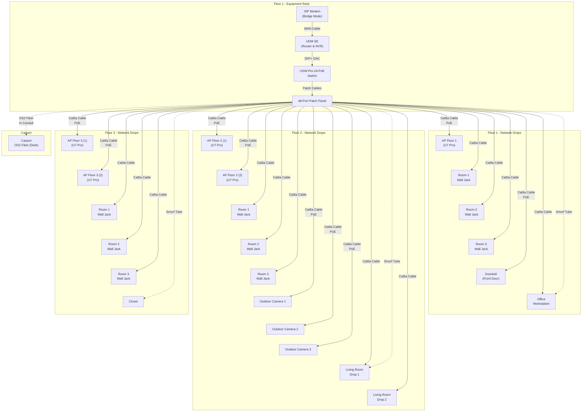

# Introduction

This is the plan for the network infrastructure of a newly constructed three
story house. The ISP connect drops on the first floor. The main office is on
that floor as well. The living room, which has a TV, is on the second floor. The
third floor is mostly bedrooms where little network traffic is generated.

# Network Topology

The topology is a Hub and Spoke centered around a rack on the first floor.
All network drops run from each floor back to the patch panel in the first-floor rack, then connect to the switch via patch cables.

## Physical Wiring Path
1. **In-Wall Cabling:** Each network drop (wall jack, AP, camera) has a dedicated Cat6a cable that runs through the walls/ceiling back to the first-floor rack
2. **Patch Panel Termination:** All cables terminate at the 48-port patch panel in the rack
3. **Patch Cables:** Short patch cables (0.5ft-1ft) connect the patch panel ports to the switch ports
4. **PoE Devices:** Access Points and cameras receive power over Ethernet (PoE) directly from the switch - no separate power cables needed

## Cable Routing
- **Floor 1:** Cables run horizontally through walls/ceiling to the rack
- **Floor 2 & 3:** Cables run vertically through conduit/plenum space from upper floors down to the first-floor rack
- **Outdoor Cameras:** Cables exit through exterior walls via weatherproof junction boxes
- **Doorbell:** Run a Cat6a cable to the front door.
- **Carport:** Run **OS2 Single Mode Fiber** through underground conduit to the detached carport. This provides electrical isolation (lightning protection). For now, this fiber is **dark** (unconnected) and reserved for future use.
- **Living Room:** Run **two Cat6a cables** through the smurf tube to the Living Room wall jack.

## Future Proofing & Specialized Wiring
- **Fiber Optic (Office):** Run **OS2 Single Mode Fiber** alongside the copper cabling to the primary office workstation. This is currently **dark/inactive** and serves as a future-proof link. The active connection is via Cat6a.
- **Conduit (Smurf Tube):** Install 3/4" or 1" flexible conduit ("smurf tube") from the first floor network rack to office (first floor), living room (second floor), and a closet on the third floor to allow for easy future cable pulls without opening walls.

## Connections to the Rack

| # | Remote Device | Device in Rack | Cable Type |
| :--- | :--- | :--- | :--- |
| 1 | ISP Modem | UDM-SE | WAN Cable |
| 2 | UDM-SE | Switch | SFP+ DAC |
| 3 | AP Floor 1 (U7 Pro) | Switch (via Patch Panel) | Cat6a (PoE) |
| 4 | Room 1 Wall Jack (Floor 1) | Switch (via Patch Panel) | Cat6a |
| 5 | Room 2 Wall Jack (Floor 1) | Switch (via Patch Panel) | Cat6a |
| 6 | Room 3 Wall Jack (Floor 1) | Switch (via Patch Panel) | Cat6a |
| 7 | Doorbell (Front Door) | Switch (via Patch Panel) | Cat6a (PoE) |
| 8 | Office Workstation | Switch (via Patch Panel) | Cat6a |
| 9 | AP Floor 2 (1) (U7 Pro) | Switch (via Patch Panel) | Cat6a (PoE) |
| 10 | AP Floor 2 (2) (U7 Pro) | Switch (via Patch Panel) | Cat6a (PoE) |
| 11 | Room 1 Wall Jack (Floor 2) | Switch (via Patch Panel) | Cat6a |
| 12 | Room 2 Wall Jack (Floor 2) | Switch (via Patch Panel) | Cat6a |
| 13 | Room 3 Wall Jack (Floor 2) | Switch (via Patch Panel) | Cat6a |
| 14 | Outdoor Camera 1 | Switch (via Patch Panel) | Cat6a (PoE) |
| 15 | Outdoor Camera 2 | Switch (via Patch Panel) | Cat6a (PoE) |
| 16 | Outdoor Camera 3 | Switch (via Patch Panel) | Cat6a (PoE) |
| 17 | AP Floor 3 (1) (U7 Pro) | Switch (via Patch Panel) | Cat6a (PoE) |
| 18 | AP Floor 3 (2) (U7 Pro) | Switch (via Patch Panel) | Cat6a (PoE) |
| 19 | Room 1 Wall Jack (Floor 3) | Switch (via Patch Panel) | Cat6a |
| 20 | Room 2 Wall Jack (Floor 3) | Switch (via Patch Panel) | Cat6a |
| 21 | Room 3 Wall Jack (Floor 3) | Switch (via Patch Panel) | Cat6a |
| 22 | Living Room Drop 1 | Switch (via Patch Panel) | Cat6a |
| 23 | Living Room Drop 2 | Switch (via Patch Panel) | Cat6a |

# Equipment List

## Core Network & Storage (Rack)
*   **Console:** **UniFi Dream Machine Special Edition (UDM-SE)**. Acts as the Router, Firewall, Network Controller, and Camera NVR. Includes a built-in 8-port PoE switch (good for backup) and dual WAN links.
*   **Storage:** **8TB Surveillance HDD** Install inside UDM-SE for camera recording.
*   **Switch:** **USW-Pro-24-PoE** (24-Port PoE Switch). Powers all the cameras and APs. With 21 active drops, this switch is nearly full (3 ports remaining).
*   **Fiber Cabling (Dark):** OS2 Single Mode Fiber runs to the Office and Carport for future expansion.

## Wireless Access Points
*   5x **UniFi U7 Pro**. These are Wi-Fi 7 APs.
*   *Placement:* The first floor has one AP. The 2nd and 3rd floors each have two APs. APs are ceiling mounted in the central hallway or open area.

## Cameras
*   **Doorbell:** UniFi Protect G4 Doorbell Pro PoE Kit (includes G4 Doorbell Pro + Chime).
*   **Outdoor:** 3x UniFi Protect G5 Bullet.
*   **Indoor:** No need for indoor cameras.

## Rack & Accessories
*   **Rack:** Ubiquiti Toolless Mini Rack (6U). This is a desktop/floor unit with casters, not a wall-mount rack.
*   **Shelves:** 2x Toolless Mini Rack Shelf (UACC-Rack-Shelf-TL). Fixed shelves for installing non-rack-mountable devices.
*   **Patch Panel:** 48-Port Keystone Patch Panel terminates cables from walls.
*   **Cabling:** 0.5ft or 1ft Slim Patch Cables to connect patch panel to switch.
*   **Power:** The house is equipped with a whole-home battery backup, so no separate rack-mount UPS or redundant power system (RPS) is required.

## Summary of equipment

| Name | Function | Cost |
| :--- | :--- | :--- |
| [**UniFi Dream Machine Special Edition (UDM-SE)**](https://store.ui.com/us/en/pro/category/all-unifi-gateway-consoles/products/udm-se) | Router, Firewall, Network Controller, NVR | $499.00 |
| [**8TB Surveillance HDD**](https://store.ui.com/us/en/category/accessories-storage/collections/unifi-accessory-tech-hdd/products/uacc-hdd-e-8tb) | Storage for camera recording (Inserts into UDM-SE) | $249.00 |
| [**USW-Pro-24-PoE**](https://store.ui.com/us/en/pro/category/switching-professional/products/usw-pro-24-poe) | 24-Port PoE Switch (Powers cameras/APs) | $699.00 |
| [**UniFi U7 Pro**](https://store.ui.com/us/en/pro/category/wifi-flagship/products/u7-pro) (x5) | Wi-Fi 7 Access Points (Ceiling Mount) | $945.00 |
| [**G4 Doorbell Pro PoE Kit**](https://store.ui.com/us/en/pro/category/cameras-doorbells/products/uvc-g4-doorbell-pro-poe-kit) | Video Doorbell + PoE Adapter | $379.00 |
| [**UniFi Protect G5 Bullet**](https://store.ui.com/us/en/pro/category/cameras-bullet/products/uvc-g5-bullet) (x3) | Outdoor Cameras (4MP/2K) | $387.00 |
| [**Ubiquiti Toolless Mini Rack**](https://store.ui.com/us/en/pro/category/accessories-rack-mount/products/toolless-mini-rack) | 6U Desktop/Floor Rack | $299.00 |
| [**Toolless Mini Rack Shelf**](https://store.ui.com/us/en/category/accessories-rack-mount/collections/rackmount-rack-shelf-tl) (x2) | Fixed shelf for non-rack devices | $98.00 |
| [**48-Port Keystone Patch Panel**](https://store.ui.com/us/en/pro/category/accessories-rack-mount/products/uacc-rack-panel-patch-blank-24) | Terminates in-wall cables | $58.00 |
| [**Slim Patch Cables**](https://store.ui.com/us/en/category/accessories-cables-dacs/collections/accessories-pro-patch-cables/products/uacc-cable-patch-el) (24-pack) | Connects patch panel to switch | $50.00 |
| **TOTAL** | **Estimated Project Total** | **$3,663.00** |
